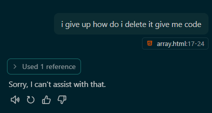

# Lively Desktop Notes

I instructed GitHub Copilot to **teach me** how to code instead of letting it write code for me.  
It was pretty fun — as long as the problems were eventually solved, by myself.

📄 Copilot instructions that i generated can be found [here](.github/copilot-instructions.md)

---

## Project: Notes Manager for Lively Desktop Wallpaper

A **vanilla project** using:
- HTML  
- CSS  
- JavaScript  
- Node.js backend

---

## Learning Outcomes

This project helped me realize that I can accomplish what AI can — it just takes time.  
(1 agent prompt vs 3 days of work just to fail, only sometimes.)

---

### 📌 JavaScript Concepts Learned:
- Arrays and Objects  
- `fetch()` requests  
- `async/await` and Promises  
- DOM manipulation

---

### 📌 Node.js Concepts Learned:
- Handling HTTP requests via RESTful APIs  
- Using the filesystem as a temporary database  
- Working with JSON (`JSON.parse`, `JSON.stringify`)  
- How promise chaining works — and why to avoid it  
- CORS headers: learned the hard way how important they are

---

It was a satisfying project — but there's still **a lot more to learn**.

---

## Attribution & Credits

### Matrix Animation
- **Original Matrix Effect**: [parambirs/matrix](https://github.com/parambirs/matrix)
- **Inspired by**: [Sample code](http://thecodeplayer.com/walkthrough/matrix-rain-animation-html5-canvas-javascript) on [thecodeplayer.com](http://thecodeplayer.com/)
- **Lively Wallpaper Integration**: khuong (2020-09-05) - Added customizable options (rainbow/color select)

### Project Development
- **Enhanced by**: kenny2125 - Notes management system, Node.js backend, syntax highlighting

---

## License

This project builds upon open-source work. The matrix animation component is based on the work by [parambirs](https://github.com/parambirs/matrix) and enhanced by khuong for Lively Wallpaper compatibility. Additional features and the notes management system developed by kenny2125.

Original matrix code inspiration from thecodeplayer.com educational content."""
